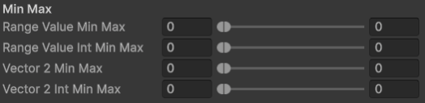
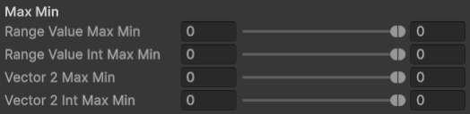
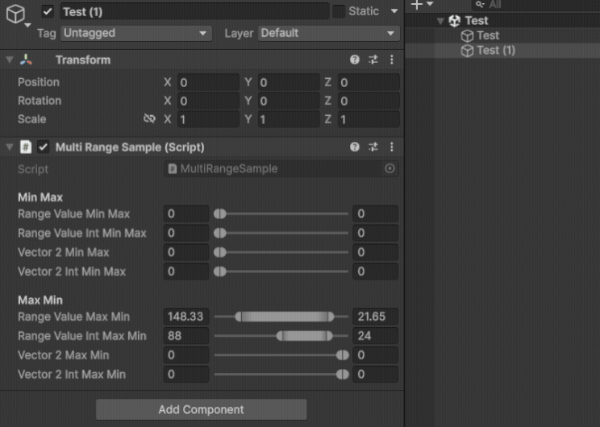

# MinMax and MaxMin Slider for Unity

## Adding to Project

1. In Package Manager choose Install package from git URL
2. Copy paste this link: `https://github.com/Parzival20451/MultiRangeSlider.git`
3. Press Install

## How to Use

1. Add namespace to your script:
```C#
using MultiRangeSlider;
```

2. Add attribute MultiRangeAttribute to your serialized property:
```C#
[Header("Min Max")]
[SerializeField, MultiRange(0f, 180.5f)] private RangeValue rangeValueMinMax;
[SerializeField, MultiRange(0, 180.5f)] private RangeValueInt rangeValueIntMinMax;
[SerializeField, MultiRange(0f, 180f)] private Vector2 vector2MinMax;
[SerializeField, MultiRange(0, 180.5f)] private Vector2Int vector2IntMinMax;

[Header("Max Min")]
[SerializeField, MultiRange(180f, 0f)] private RangeValue rangeValueMaxMin;
[SerializeField, MultiRange(180.5f, 0f)] private RangeValueInt rangeValueIntMaxMin;
[SerializeField, MultiRange(180f, 0f)] private Vector2 vector2MaxMin;
[SerializeField, MultiRange(180.5f, 0f)] private Vector2Int vector2IntMaxMin;
```

It will choose automatically which slider to apply (min-max or max-min) depending on whether left limit > right limit.

Supported types: **RangeValue**, **RangeValueInt**, **Vector2**, **Vector2Int**.
*In Vector2/Vector2Int for min-max slider x and y are min and max relatively, for max-min slider x and y are **max and min** relatively. But you can change it by changing IS_INVERTED in MaxMinRangeStrategy on [this line](https://github.com/Parzival20451/MultiRangeSlider/blob/214ae6cd46357729a8d54479c4f8bf8f8478627c/Editor/MaxMinRangeStrategy.cs#L9).*

My structs structure (I created them for better code readibility instead of using x and y of Vector2):
```C#
[System.Serializable]
public struct RangeValue
{
	public float min;
	public float max;

	public RangeValue(float min, float max)
	{
		this.min = min;
		this.max = max;
	}

	public static implicit operator RangeValue(RangeValueInt rangeValueInt)
	{
		return new RangeValue(rangeValueInt.min, rangeValueInt.max);
	}
}

[System.Serializable]
public struct RangeValueInt
{
	public int min;
	public int max;

	public RangeValueInt(int min, int max)
	{
		this.min = min;
		this.max = max;
	}
}
```

You can try it out by adding MultiRangeSample script to your object.

## Examples

Min-Max Slider



Max-Min Slider



Multi-Editing


